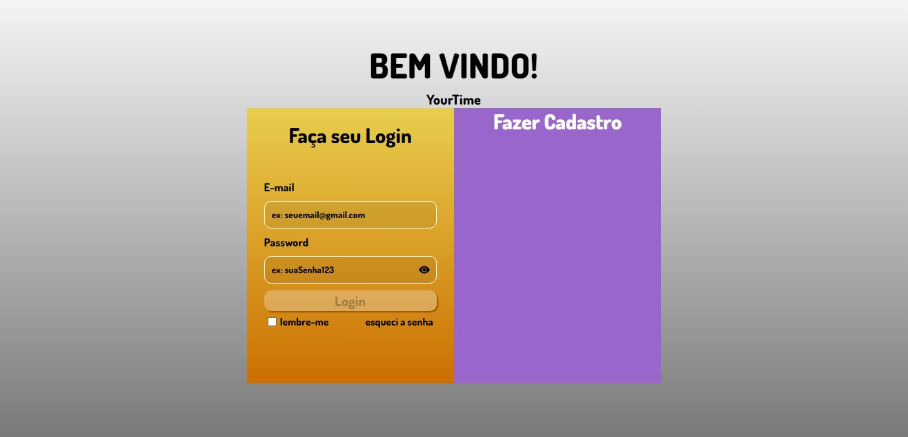

# Tela de Login

 

# Objetivo
- ## Criação de uma tela de login, para um app em desenvolvimento (YourTime), somente um protótipo para treino na criação de paginas com o React

 
 
 

# Ferramentas

- ## React
- ## React Icons
- ## Figma
- ## Git, GitHub, GitHubPages

 
 
 

# Previw

 
 
 

# Link de acesso.

<html>
    <a href="https://douglasarthurr.github.io/Project-web-login/">Clique aqui para acessar a página</a>
</html>

 
 
 

# Autor

[ Douglas Arthur da Silva Bento](https://github.com/douglasarthurr)
